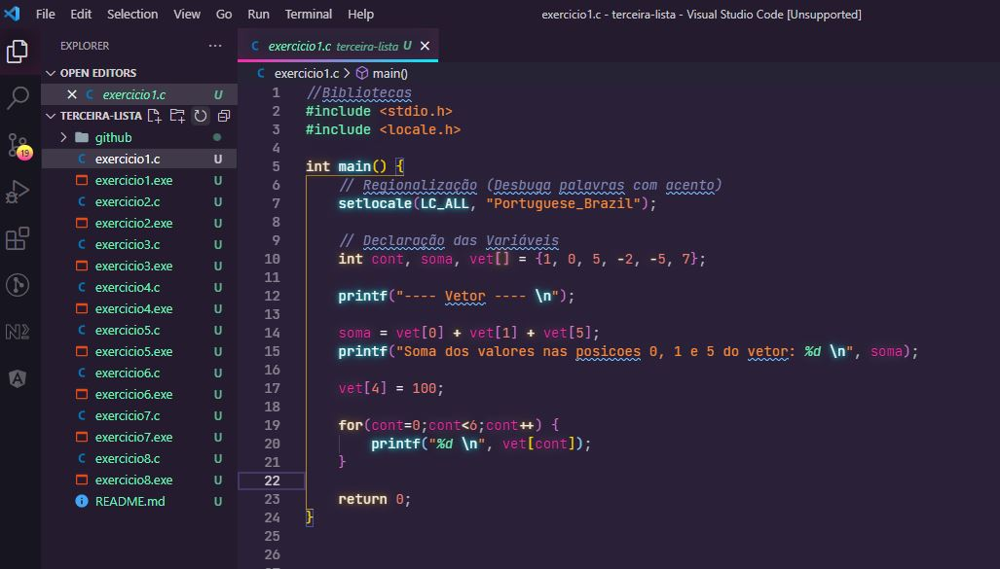

<h1 align="center">
    
</h1>

    <h3> 🔵 Terceira Lista 🔵 </h3>
    
     
    

## Lista 3

Lista de exercícios para praticar algoritmo estruturado e lógica de programação.

## Questões

1.	Faça um programa que possua um vetor denominado vet que armazene 6 números inteiros. O programa deve executar os seguintes passos: 
a.	Atribua os seguintes valores a esse vetor: 1, 0, 5, -2, -5, 7.
b.	Armazene em uma variável inteira (simples) a soma entre os valores das posições vet[0], vet[1] e vet[5] do vetor e mostre na tela esta soma.
c.	Modifique o vetor na posição 4, atribuindo a esta posição o valor 100.
d.	Mostre na tela cada valor do vetor vet, um em cada linha.
2.	Fazer um programa para ler 5 valores e, em seguida, mostrar a posição onde se encontram o maior e o menor valor.
3.	Faça um programa que leia dois vetores de 10 posições e calcule outro vetor contendo, nas posições pares os valores do primeiro e nas posições impares os valores do segundo.
4.	Faça um programa que preenche uma matriz 4 x 4 com o produto do valor da linha e da coluna de cada elemento. Em seguida, imprima na tela a matriz.
5.	Gerar e imprimir uma matriz de tamanho 10 x 10, onde seus elementos são da forma:
•	mtz[lin][col] = 2lin + 7col – 2	se lin < col
•	mtz[lin][col] = 3lin2 – 1		se lin = col
•	mtz[lin][col] = 4lin3 − 5 col2 + 1	se lin > col
6.	Faca programa que leia uma matriz 3 x 6 com valores reais. 
a.	Imprima a soma de todos os elementos das colunas ímpares.
b.	Imprima a média aritmética dos elementos da segunda e quarta colunas.
c.	Substitua os valores da sexta coluna pela soma dos valores das colunas 1 e 2.
d.	Imprima a matriz modificada.
7.	Leia uma matriz 10 x 3 com as notas de 10 alunos em 3 provas. Em seguida, escreva o número de alunos cuja pior nota foi na prova 1, o número de alunos cuja pior nota foi na prova 2, e o número de alunos cuja pior nota foi na prova 3. Em caso de empate das piores notas de um aluno, o critério de desempate é arbitrário, mas o aluno deve ser contabilizado apenas uma vez.
8.	Faça um programa para gerar automaticamente números entre 0 e 99 de uma cartela de bingo. Sabendo que cada cartela deverá conter 5 linhas de 5 números, gere estes dados de modo a não ter números repetidos dentro das cartelas. O programa deve exibir na ´ tela a cartela gerada.
 

## 🛠️ Linguagem

💻 C

### ☑️ Código:

## 🌟 CEFET / RJ

Essa lista foi passada no meu curso de Sistemas de Informação realizado no CEFET.

